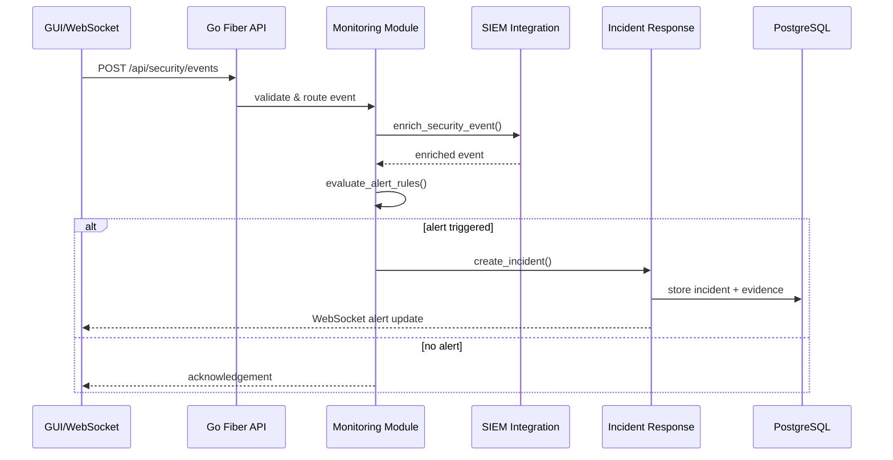
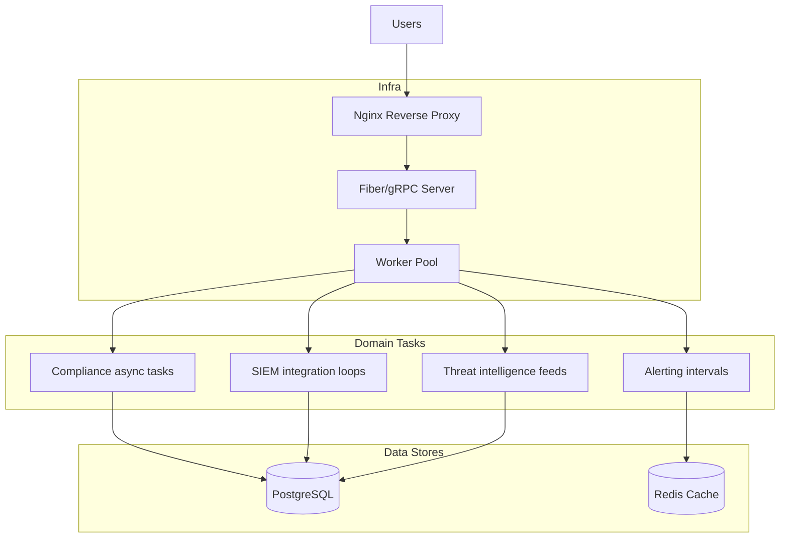
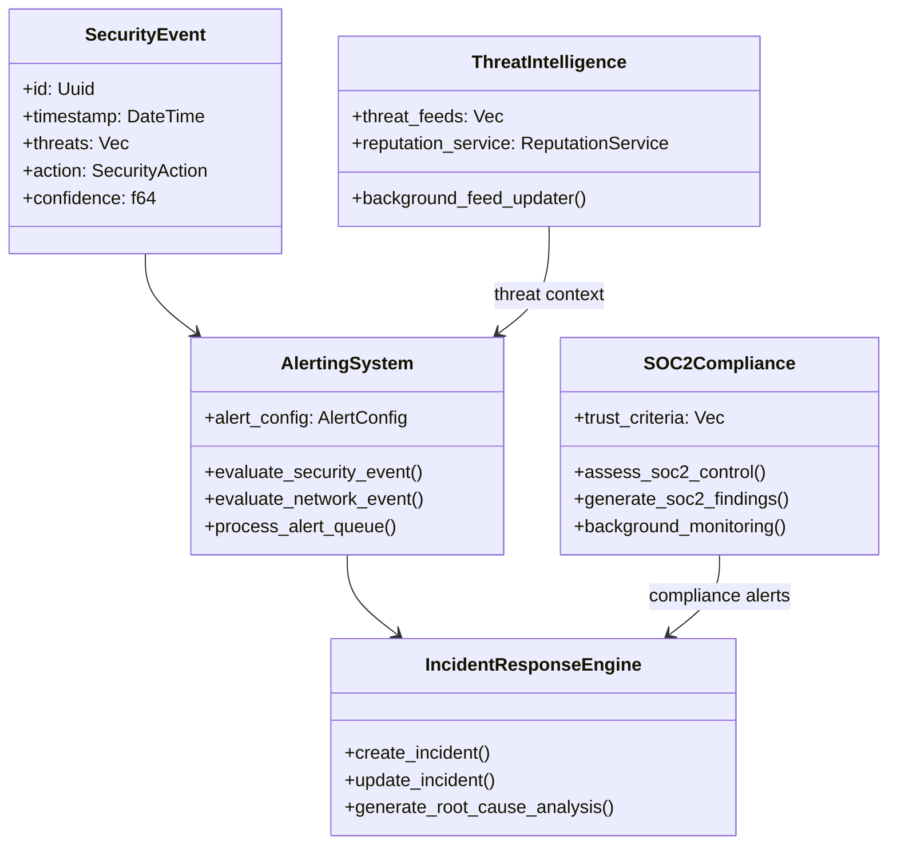
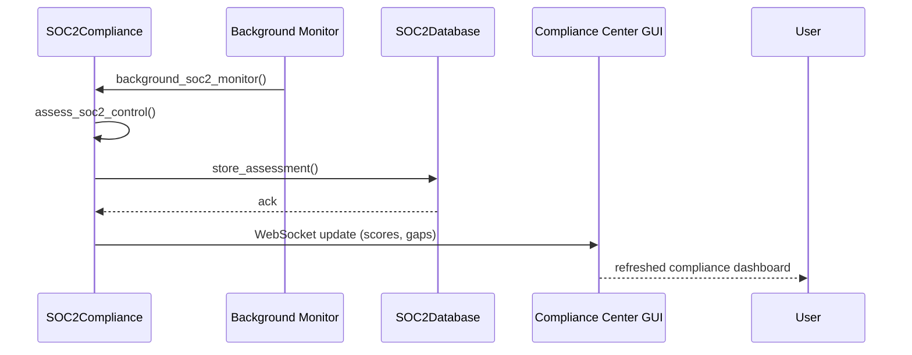

# Barca-Strategos Phoenix Architecture Review & Technical Specification

**Author:** Cascade AI (Architect & Cybersecurity Product Owner)  
**Date:** March 2026  
**Scope:** Comprehensive architectural review, refactoring guidance, and functional/technical documentation with security emphasis and Mermaid diagrams.

---

## 1. Executive Summary

Barca-Strategos Phoenix is a modular Go platform delivering security operations, compliance automation, and collaborative dashboards through a Fiber/gRPC service layer and Web GUI. The architecture already exhibits clear domain separation (common types → compliance/security/monitoring → GUI), goroutine-driven async processing, and a strong focus on regulated workflows. However, technical debt inherited from the former Rust codebase—duplicate type definitions, missing trait derives, inconsistent serialization, and ambiguous module boundaries—currently hinders compilation and maintainability. This document captures:

1. Architectural mapping of modules, data paths, and external integrations.  
2. Security posture, operational workflow, and reliability considerations.  
3. Refactoring recommendations aligned with clean architecture, testability, and cyber-defense best practices.  
4. Functional and technical specifications that can guide backlog prioritization.  
5. Mermaid diagrams (component, class, sequence, deployment) for shared understanding.

---

## 2. Architectural Overview

### 2.1 High-Level Component Diagram

```mermaid
graph TB
    subgraph Presentation
        GUI[Web GUI / Dashboards]
        RTM[Real-Time Monitoring Workspace]
        Bots[Chat Bots (Telegram/Slack/etc.)]
    end

    subgraph Service Layer (Go/Fiber)
        API[REST & gRPC Routes]
        Auth[JWT/CORS/Trace Middleware]
    end

    subgraph Domain Modules
        Common[Common Types]
        Compliance[Compliance Engines]
        Security[Security Suite]
        Monitoring[Monitoring & SIEM]
        GUI_Svc[GUI-Oriented Services]
    end

    subgraph Data & Infra
        PG[(PostgreSQL)]
        Redis[(Redis)]
        Files[(Static Assets)]
    end

    GUI --> API
    Bots --> API
    RTM --> API

    API --> Auth
    Auth --> Compliance
    Auth --> Security
    Auth --> Monitoring
    Auth --> GUI_Svc

    Compliance --> Common
    Security --> Common
    Monitoring --> Common
    GUI_Svc --> Common

    Monitoring --> PG
    Compliance --> PG
    Security --> PG
    GUI_Svc --> Redis
    API --> Files
```

### 2.2 Module Responsibilities

| Module | Responsibilities | Key Files |
| --- | --- | --- |
| `common` | Canonical data models (UserId, MonitoringConfig, Risk models) and shared enums used across domains. | `src/common/types.rs` |
| `compliance` | Framework-specific engines (ISO 27001, NIST CSF, GDPR, SOC2, PCI DSS) providing assessments, recommendations, and monitoring loops. | `src/compliance/*.rs` |
| `security` | Cryptography, network defense, runtime application self-protection (RASP), Data Classification. | `src/security/*.rs` |
| `monitoring` | SIEM integration, alerting, advanced monitoring/analytics, threat intelligence, incident response. | `src/monitoring/*.rs` |
| `gui` | Go-served GUI modules (dashboards, collaboration, compliance center, SOC) and utility services (AlertEngine, VisualizationEngine). | `src/gui/*.rs` |

---

## 3. Functional Specification

### 3.1 Core Use Cases

1. **Security Event Lifecycle**: Ingest events → enrich via SIEM integration → correlate with threat intelligence → alert → incident response workflow with evidence tracking.
2. **Compliance Automation**: Run continuous assessments for SOC2/PCI/ISO, produce metrics, log outputs, and update GUI dashboards.
3. **Risk & Collaboration**: Provide cognitive collaboration spaces, risk management dashboards, and real-time monitoring loops exposed via Web GUI and chat bots.
4. **Observability & Health**: Serve REST health endpoints, WebSocket channels for live metrics, and integrate with external monitoring stacks (Prometheus, Grafana, Jaeger per README).

### 3.2 Functional Domains & Actors

| Actor | Functional Goals |
| --- | --- |
| Security Analyst | Monitor alerts, triage incidents, execute response playbooks. |
| Compliance Officer | Run assessments, review gaps, export reports. |
| Risk Manager | Track risk posture, mitigation plans, and trend analytics. |
| AI Agents (Bots) | Provide chat-based status, issue commands, escalate events. |
| System Integrations | Consume health metrics, logs, and event streams for observability. |

---

## 4. Technical Specification

### 4.1 Data Flow (Sequence Diagram)



### 4.2 Deployment Diagram (Go + Edge Services)



### 4.3 Class Diagram (Key Types)



### 4.4 APIs & Interfaces

- **REST Endpoints** (examples): `/api/system/health`, `/api/security/incidents`, `/api/compliance/assess`, `/api/risk/items`.
- **WebSockets**: `/ws` for general channel, with specialized loops in GUI modules for metrics and collaboration updates.
- **Async Traits**: `async_trait` used for compliance engines, monitoring services, and GUI helper engines (AlertEngine, VisualizationEngine).
- **Background Tasks**: `tokio::time::interval` loops driving feed updates, compliance checks, metrics collection.

---

## 5. Security Review

1. **Zero-Trust Orientation**: Modules (security, monitoring, compliance) exchange structured types; recommended to enforce explicit access layers to prevent cross-module leakage.  
2. **Event Integrity**: `SecurityEvent` flows should leverage typed wrappers (`SecurityEventData`) + serialization to avoid mismatched types (observed in SIEM integration).  
3. **Authentication & Authorization**: README references JWT and RBAC; implementation must align with middleware in `main.rs` (currently permissive). Introduce configurable allowed origins and token validation hooks.  
4. **Cryptography Modules**: `security/cryptography.rs` imports ring & async_trait but currently has unused variables; finalize encryption key storage, integrate with configuration, and ensure keys never serialized to logs.  
5. **Evidence Handling**: `IncidentResponse` now derives `PartialEq` on `EvidenceSeverity`; extend to `Eq`/`Hash` if used as map keys, enforce tamper-proof logging (append-only).  
6. **Third-Party Feeds**: `threat_intelligence.rs` uses `ThreatLevel`, `ThreatType`; ensure sanitized inputs and rate limiting for feed ingestion.

---

## 6. Refactoring & Improvement Recommendations

| Priority | Theme | Actions |
| --- | --- | --- |
| P0 | **Common Data Consistency** | Finalize deduplication of `MonitoringConfig`, `ComplianceMonitor`, `FindingSeverity`, etc., centralized in `common::types`. Ensure SOC2/PCI modules import (no aliases). |
| P0 | **Serialization Safety** | Remove `Serialize` derive from structs containing `Arc<RwLock<...>>` (already done for `SOC2Database`), or wrap in DTOs for API exposure. |
| P1 | **Naming Consistency** | Standardize enums (`IncidentType::DataLeak`) and ensure GUI/Monitoring code references canonical variants. |
| P1 | **Alerting Type Imports** | Replace wide `use crate::gui::*`/`monitoring::*` with explicit imports to eliminate ambiguous types (`AlertConfig`). |
| P1 | **SecurityEvent Unification** | Introduce dedicated `SecurityEventData` struct in `common`, referenced by monitoring/security/GUI modules to avoid mismatch. |
| P2 | **Async Task Supervision** | Encapsulate background loops (interval tasks) into supervisor struct to improve lifecycle management and testability. |
| P2 | **Testing & Lints** | Add integration tests for compliance engines, property tests for risk scoring, and enforce `#![deny(unused_imports)]` in modules once code stabilizes. |
| P3 | **Documentation Automation** | Generate API & schema docs (e.g., `utoipa` or `paperclip`) to keep specification synced with Rust types. |

---

## 7. Operational & Non-Functional Requirements

| Category | Requirement |
| --- | --- |
| Performance | GUI should support 500 concurrent users (aligned with README scaling). Background tasks must not block Axum executor. |
| Reliability | Interval tasks should catch errors and retry with exponential backoff. Introduce health metrics for each compliance/monitoring subsystem. |
| Observability | Instrument modules with `tracing` spans (already partially). Export Prometheus metrics for incident counts, compliance scores, threat feed latency. |
| Security | Enforce TLS termination at Nginx, mutual auth for agent-to-core traffic, rotate API keys/secrets stored in `.env`. |
| Compliance | Provide audit logs for SOC/PCI actions, including `who/when/what` at GUI level. |

---

## 8. Detailed Sequence: Compliance Trigger to Dashboard Update



---

## 9. Recommendation Backlog (Actionable)

1. **Complete Compilation Fixes**: Finish resolving E0255/E0308/E0603/E0659 errors outlined in `log_build.txt` to regain build stability.
2. **Schema Validation Layer**: Introduce DTOs for API responses, keeping internal structs private to modules.
3. **Security Hardening**: Implement JWT validation middleware, environment-driven CORS, and audit logging wrappers.
4. **Config Abstraction**: Add `Config` struct bridging `.env` to modules (Duration conversions, API keys).
5. **Async Supervisors**: Create `MonitoringSupervisor` and `ComplianceSupervisor` to manage interval tasks and share state via channels instead of direct clones.
6. **Testing Roadmap**: Add integration tests per domain; start with SOC2 assessments, alert matching, and incident creation under different severity levels.

---

## 10. Conclusion

Barca-Strategos Phoenix has a well-articulated mission and modular codebase, but immediate technical debt obscures its strengths. By addressing foundational compilation errors, unifying shared types, tightening security validation, and formalizing documentation (this specification), the platform will be positioned for faster feature delivery and higher assurance in regulated environments. The diagrams and recommendations herein should serve as a living reference for engineering, security, and product stakeholders.

---

*Document generated by Cascade AI upon reviewing the Barca-Strategos repository on March 2026.*
