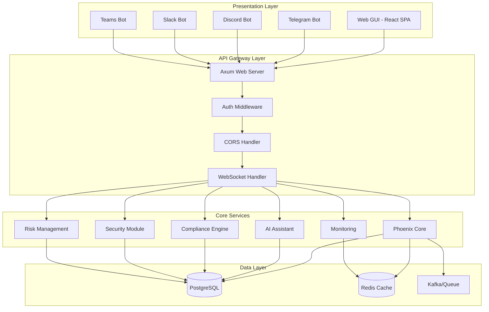
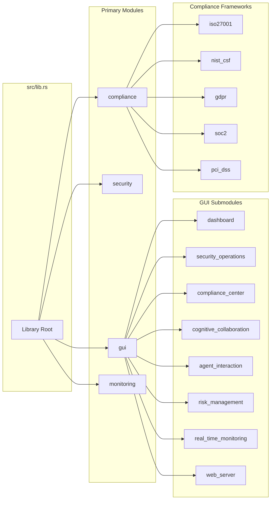
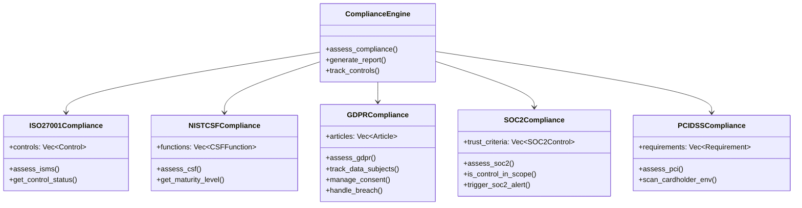
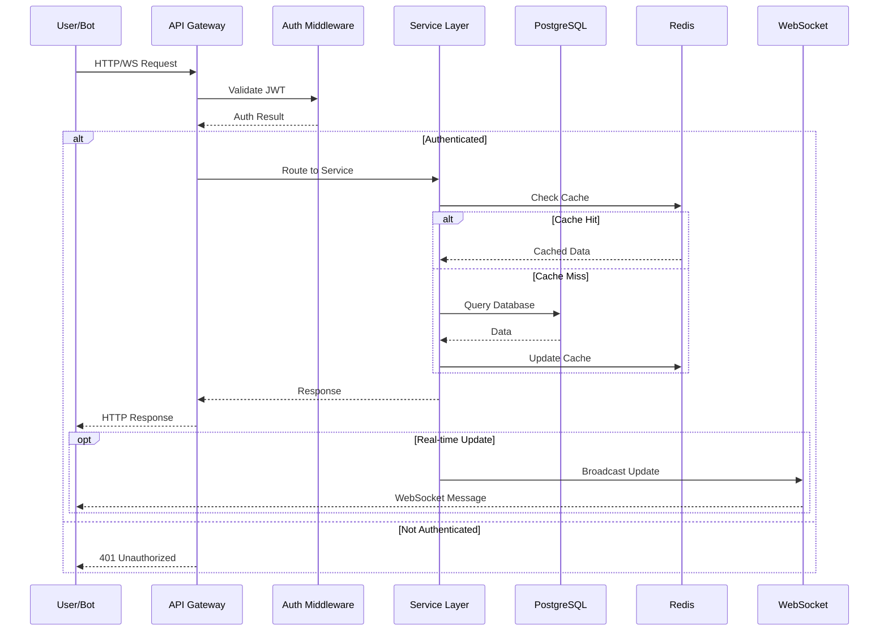
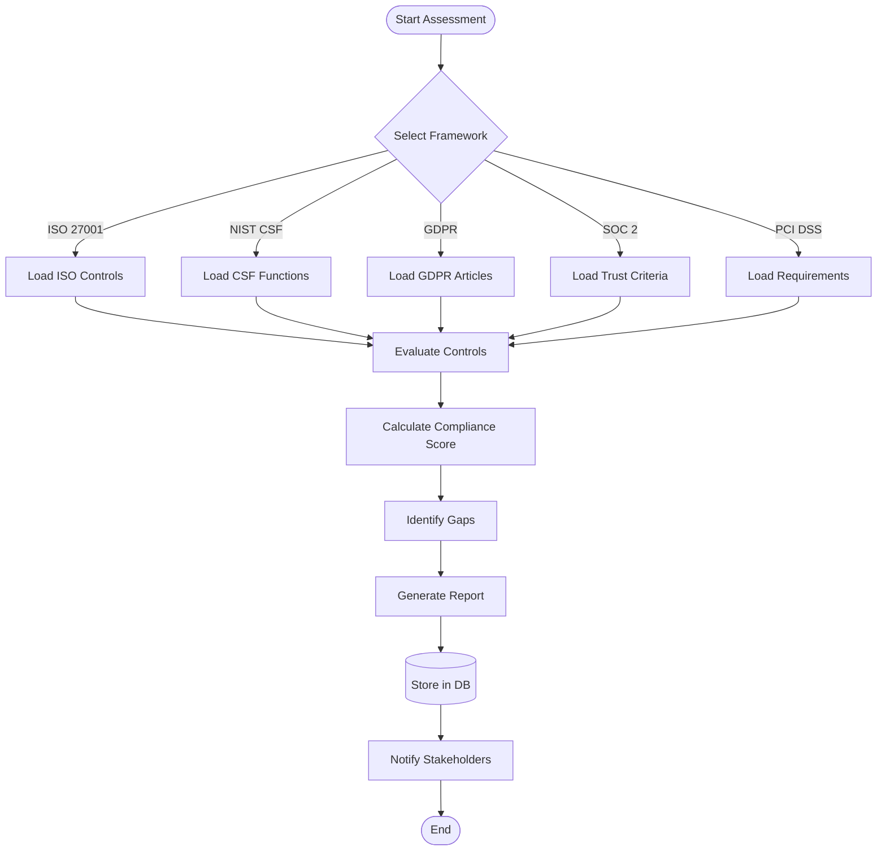
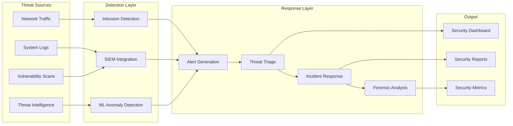
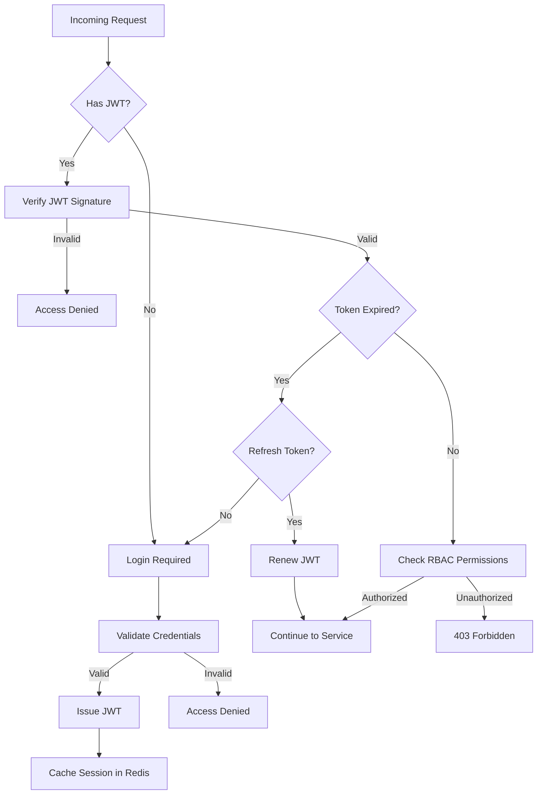
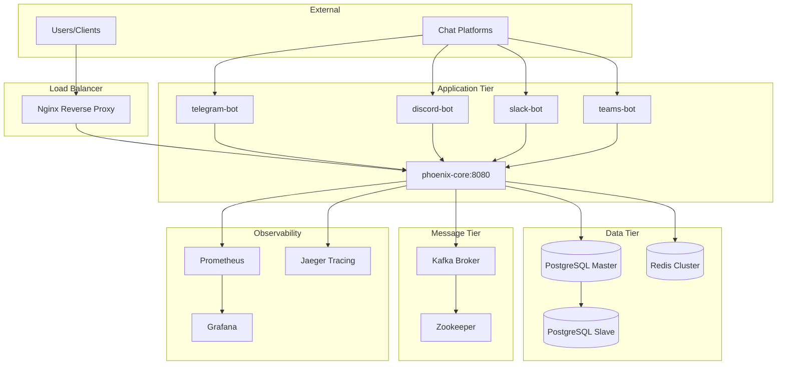
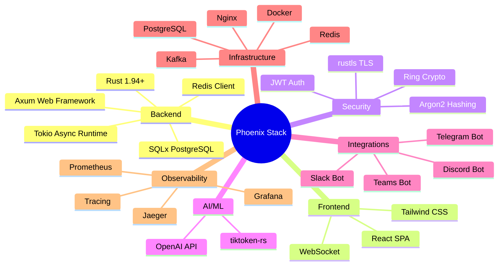
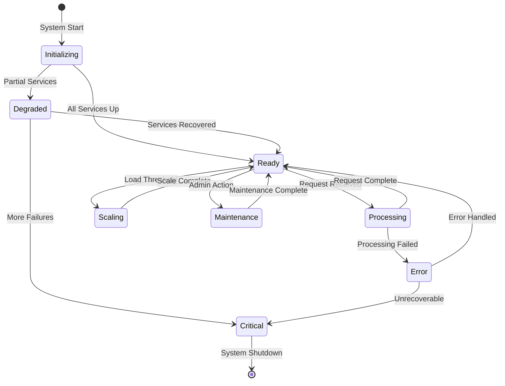

# Barca-Strategos Phoenix: Architecture Specification

## Document Overview

**Version**: 1.0  
**Date**: March 2026  
**Status**: Post-Refactor Baseline  

This document provides a comprehensive architectural overview of the Barca-Strategos Phoenix platform using Mermaid diagrams for visual representation of system components, data flows, and deployment topology.

---

## 1. High-Level System Architecture

The Phoenix platform follows a **Microservices + Multi-Agent** architecture pattern, enabling independent scaling and clear domain separation.



---

## 2. Module Architecture

### 2.1 Core Module Dependencies



### 2.2 Compliance Module Detail



---

## 3. Data Flow Architecture

### 3.1 Request Processing Flow



### 3.2 Compliance Assessment Flow



---

## 4. Security Architecture

### 4.1 Security Operations Center Flow



### 4.2 Authentication & Authorization



---

## 5. Deployment Architecture

### 5.1 Docker Compose Topology



### 5.2 Local Installation Architecture

```mermaid
graph TB
    subgraph "Ubuntu Server"
        subgraph "Systemd Services"
            PHX[phoenix-core.service]
        end

        subgraph "System Services"
            PG[PostgreSQL 15]
            RD[Redis Server]
            NGX[Nginx]
        end

        subgraph "Directories"
            OPT[/opt/phoenix]
            BIN[/opt/phoenix/bin]
            SRC[/opt/phoenix/src]
            LOG[/var/log/phoenix]
        end

        subgraph "User"
            USR[phoenix user]
        end
    end

    subgraph "External Access"
        HTTP[HTTP :80]
        HTTPS[HTTPS :443]
        API[API :8080]
    end

    HTTP --> NGX
    HTTPS --> NGX
    NGX --> PHX
    PHX --> PG
    PHX --> RD
    USR --> PHX
    PHX --> BIN
    PHX --> LOG
```

---

## 6. Technology Stack Summary



---

## 7. API Endpoints Architecture

```mermaid
graph LR
    subgraph "REST API"
        subgraph "Dashboard"
            D1[GET /api/dashboard]
            D2[GET /api/dashboard/metrics]
        end

        subgraph "Security"
            S1[GET /api/security/threats]
            S2[POST /api/security/incidents]
            S3[GET /api/security/vulnerabilities]
        end

        subgraph "Compliance"
            C1[GET /api/compliance/status]
            C2[POST /api/compliance/assess]
            C3[GET /api/compliance/reports]
        end

        subgraph "Risk"
            R1[GET /api/risk/items]
            R2[POST /api/risk/assess]
            R3[PUT /api/risk/mitigate]
        end

        subgraph "Agents"
            A1[GET /api/agents/status]
            A2[POST /api/agents/scale]
            A3[GET /api/agents/tasks]
        end
    end

    subgraph "WebSocket API"
        WS1[/ws - Main Connection]
        WS2[/ws/collab - Collaboration]
        WS3[/ws/metrics - Live Metrics]
        WS4[/ws/alerts - Security Alerts]
    end

    subgraph "Health"
        H1[GET /api/system/health]
    end
```

---

## 8. State Management



---

## Appendix: File Structure

```
barca-strategos/
├── src/
│   ├── main.rs              # Application entry point
│   ├── lib.rs               # Library root (gui, security, compliance, monitoring)
│   ├── gui/
│   │   ├── mod.rs
│   │   ├── dashboard.rs
│   │   ├── security_operations.rs
│   │   ├── compliance_center.rs
│   │   ├── cognitive_collaboration.rs
│   │   ├── agent_interaction.rs
│   │   ├── risk_management.rs
│   │   ├── real_time_monitoring.rs
│   │   └── web_server.rs
│   ├── compliance/
│   │   ├── mod.rs
│   │   ├── iso27001.rs
│   │   ├── nist_csf.rs
│   │   ├── gdpr.rs
│   │   ├── soc2.rs
│   │   └── pci_dss.rs
│   ├── security/
│   │   └── mod.rs
│   └── monitoring/
│       └── mod.rs
├── Cargo.toml
├── Dockerfile
├── docker-compose.yml
├── install-local.sh
└── docs/
    ├── report.md
    ├── claude.md
    └── architecture-specification.md
```

---

*Document generated from Barca-Strategos Phoenix Comprehensive Analysis Report*
